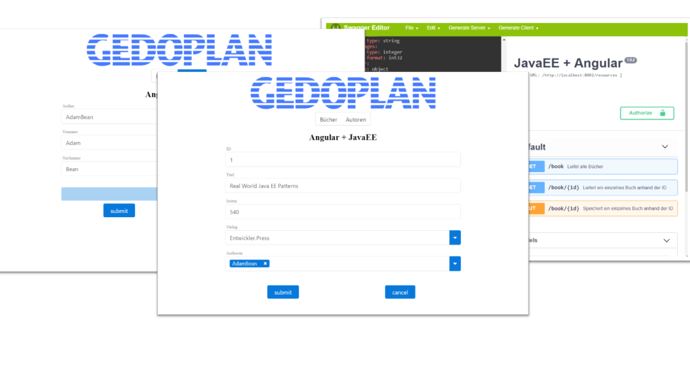

# Java EE meets Angular & Co

## Demo Projekt zur GEDOPLAN Aktuell

https://gedoplan-it-consulting.de/veroeffentlichungen/gedoplan-aktuell/

Webanwendungen in Java EE werden mit JSF implementiert,
ist es doch das Framework welches im Standard vorhanden ist.
Alternativen sucht man hier, spätestens nach der Übergabe von MVC (JSR371) an die Community, im Standard vergeblich. Also bleiben wir bei JSF, schließlich wird es seid Jahren erfolgreich in Projekten eingesetzt. Oder wagen wir den Blick über den Tellerrand? Neben einer Vielzahl von Java-Frameworks zur Implementierungen von Benutzeroberflächen rücken JavaScript Anwendungen auch für Java-Entwickler immer mehr in den Fokus. Also nehmen wir z.B. das derzeit so populäre Angular und bringen es ganz einfach und mal eben mit unserem Java EE Backend zusammen. "einfach"? "mal eben"? Typische und bekanntlich gefährliche Begriffe bei der Begehung von ungewohnten Pfaden in der Softwareentwicklung. In diesem Artikel wollen wir versuchen genau diese Frage zu beantworten. Wie einfach ist die Verwendung von JavaScript-Anwendungen im Zusammenspiel mit Java EE? Welche Stolpersteine gibt es auf Java-Seite? Und worauf sollte geachtet werden wenn Java als Backend für ein JavaScript Anwendung verwendet wird?
